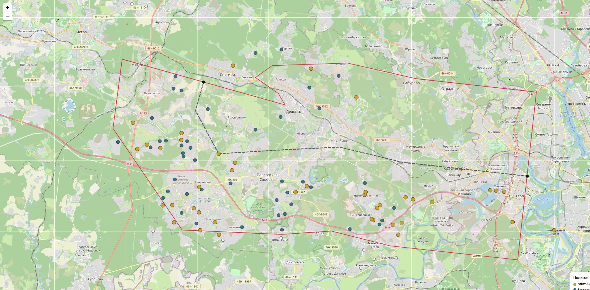

# Полигон «Новая Рига»: бизнес/элитные посёлки МКАД → ЦКАД

Гео-анализ коттеджных посёлков бизнес-класса и элитных вдоль Новорижского шоссе (М-9)
в границах **МКАД → ЦКАД**: коридор ±6,5 км от оси трассы.

**Внутри полигона — 85 посёлков (41 элитный + 44 бизнес)**, проверенных по реальным
координатам; ещё 13 у кромки коридора и 87 кандидатов по каталогу (без координат).

**Интерактивная карта:** откройте [map.html](map.html) (или GitHub Pages-ссылку ниже).

## Кластеры

1. **МКАД–10 км** (Красногорск / Ильинка / Архангельское): Резиденция Рублево, Береста,
   Архангельское, Генеральские дачи, Никольская слобода, Третья Охота, Oasis…
2. **10–20 км** (Павловское плато): Павлово (кластер), Николо-Урюпино, VillaNova,
   Пенаты, Миллениум Парк…
3. **20–31 км** (Павловская Слобода → Москва-река → развязка ЦКАД): Княжье Озеро,
   Павловская слобода, Резиденция Монолит, Монтевиль, Гринфилд, Риверсайд, Шервуд,
   Грин Хилл, Старая Рига, Снегири.

Геометрическая граница «до ЦКАД» ≈ **30–31 каталожный км от МКАД**
(Снегири 28 км — внутри; Русский Лес 41, Духанино 43, Дачи Honka 43 — за развязкой).

## Состав репозитория

| Файл | Что это |
|---|---|
| `01_poselki.md` | Таблицы посёлков: A — внутри полигона (85), B — кромка (13), C — по каталогу (87) |
| `map.html` | Интерактивная карта (Leaflet + OSM): полигон, ось М-9, маркеры по классам |
| `polygon.geojson` | Полигон-коридор + ось М-9 + точки развязок МКАД/ЦКАД |
| `villages_matched.json` | Матчинг «имя → координаты → расстояние до оси» |
| `data/domzamkad_map_h3_full.json` | Полигоны 407 посёлков с карты domzamkad (сырые данные) |
| `catalog_data.py`, `match_and_filter.py`, `build_*.py` | Скрипты сборки (воспроизводимость) |

## Метод

1. Каталог domzamkad.ru, шоссе «Новорижское»: 682 посёлка, из них бизнес-класс 250,
   элитные 96. Собраны все страницы списков.
2. Координаты — полигоны посёлков с собственной карты domzamkad (эндпоинт
   `/map/jsonp`), 407 шт. Матчинг имён со слагами: транслитерация + ручные алиасы.
3. Ось М-9: анкеры по OSM Nominatim (Опалиха, Аникеевка, Нахабино) + полигоны
   посёлков на трассе. Точность ~±1 км.
4. Развязка ЦКАД×М-9 ≈ (37.01, 55.88), точность ±1,5 км: подтверждена топонимом
   Яндекс.Карт и расположением посёлков по обе стороны границы.
5. Принадлежность полигону: центроид ≤ 6,5 км от оси. Допуск расширен с ±5 км,
   чтобы захватить кластер у Москвы-реки (Монтевиль, Гринфилд, Риверсайд, Шервуд).

## Заметки для планирования кампаний

- **Наружная реклама**: на Новорижском шоссе ~164 щита (данные агентств наружной
  рекламы), размещение ~25–60 тыс ₽/мес за щит 3×6. Логичные точки — съезды
  кластеров: МКАД/Строгино, съезд на Архангельское/Ильинку (7–9 км),
  съезд на Павловскую Слободу (~22 км).
- **Яндекс.Директ**: произвольных полигонов в геотаргетинге нет (только регионы
  геобазы) — использовать список населённых пунктов полигона или радиусные точки;
  `polygon.geojson` пригоден для площадок с полигонным таргетингом и для отчётности.

## Источники

- domzamkad.ru — каталог посёлков и карта (данные получены 2026-09-10)
- OpenStreetMap / Nominatim — опорные точки трассы
- Автодор, Википедия — параметры ЦКАД (А-113)

Данные носят справочный характер; актуальность цен и статусов посёлков проверяйте
на domzamkad.ru.
